## Requisitos

· Tener una terminal de Linux    
· Conexión a internet    
· NerdFonts

## Recursos

PowerLevel10k: [PowerLevel10kGitHub](https://github.com/romkatv/powerlevel10k)
NerdFonts: [NerdFonts](https://www.nerdfonts.com/font-downloads)

## Procedimiento

### ZSH
En este caso voy a personalizar la terminal que viene con Parrot Security, pero también es válido para otras distribuciones de Linux. Antes de empezar debemos comprobar que tengamos instalado ZSH.   
Para comprobar si está instalado en el sistema ejecutaremos el siguiente comando.
```bash
┌─[hunspook@debian]─[~]
└──╼ $zsh --version
zsh 5.8 (x86_64-debian-linux-gnu)
```
Si nos da un resultado es porque lo tenemos instalado, en caso contrario lo tendrían que instalar con `apt install zsh` y comprabamos que se haya instalado con el comando de la parte superior (`zsh --version`).

Una vez instalado ZSH lo que haremos será definirla como nuestra SHELL por defecto, haremos el cambio estando como `superusuario`.
```bash
┌─[root@debian]─[/home/hunspook]
└──╼ usermod -s /usr/bin/zsh hunspook
# Deben reemplazar "hunspook" por su nombre de usuario.
```
Para ver los cambos que se realizaron, cerraremos la sesión e ingresaremos nuevamente y la hora de abrir una terminal ya veríamos ZSH como nuestra shell.

| 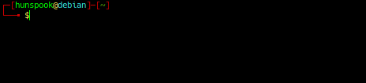 |
|:--:|
| *Antes* |

| 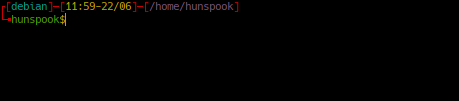 |
|:--:|
| *Después* |

Al estar usando Parrot Security los diseños son diferentes, pero para comprobar que se hicieron los cambios correctamente podemos ejecutar el siguiente comando.
```bash
┌[debian]─[11:43-22/06]─[/home/hunspook]
└╼ hunspook$echo $SHELL
/usr/bin/zsh
```
Y esto nos devolverá la SHELL que estamos usando.

### PowerLevel10k

Una vez realizado los pasos anteriores pasaremos a instalar PowerLevel10k para nuestra ZSH. Para eso ingresaremos al link que está en la parte de recursos y bajaremos hasta la parte de instalación manual.

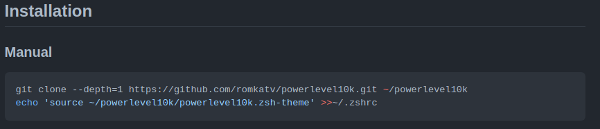

Y copiaremos los comandos en nuestra terminal. Esto lo podemos hacer tanto como para nuestro `usuario personal` como para `root`. Pero para eso debemos tener ya definida `ZSH` por defecto para nuestro `usuario personal` y para el usuario `root`. En este caso lo estoy haciendo para mi usuario personal.    
Primero clonamos el repositorio y luego copiamos y ejecutamos el siguiente comando.
```bash
┌[debian]─[11:59-22/06]─[/home/hunspook]
└╼hunspook$git clone --depth=1 https://github.com/romkatv/powerlevel10k.git ~/powerlevel10k
Clonando en '/home/hunspook/powerlevel10k'...
remote: Enumerating objects: 92, done.
remote: Counting objects: 100% (92/92), done.
remote: Compressing objects: 100% (78/78), done.
remote: Total 92 (delta 16), reused 54 (delta 10), pack-reused 0
Recibiendo objetos: 100% (92/92), 352.97 KiB | 605.00 KiB/s, listo.
Resolviendo deltas: 100% (16/16), listo.

┌[debian]─[12:18-22/06]─[/home/hunspook]
└╼hunspook$echo 'source ~/powerlevel10k/powerlevel10k.zsh-theme' >>~/.zshrc
```
Luego de haber ejecutado ambos comandos y teclearemos `zsh` en la terminal y le daremos a `enter` para empezar con la configuración de PowerLevel10k. Para ir configurando solo tendremos que teclear la tecla que nos aparece como opción.

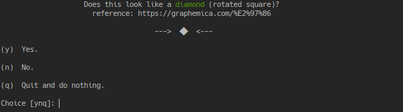

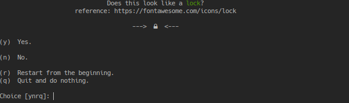

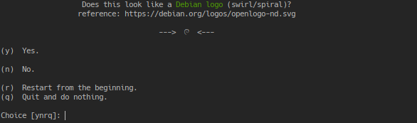

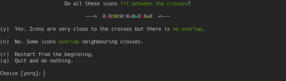

Si ven los iconos y en la cuarta imagen los iconos no están uno encima del otro pueden continuar los 4 pasos tecleando la letra `y`.   
En caso contrario necesitaremos instalar las NerdFonts, para ello nos dirigimos nuevamente a la parte de recursos y abrimos la página de NerdFonts pero primero cerraremos la configuración con la tecla `q`.

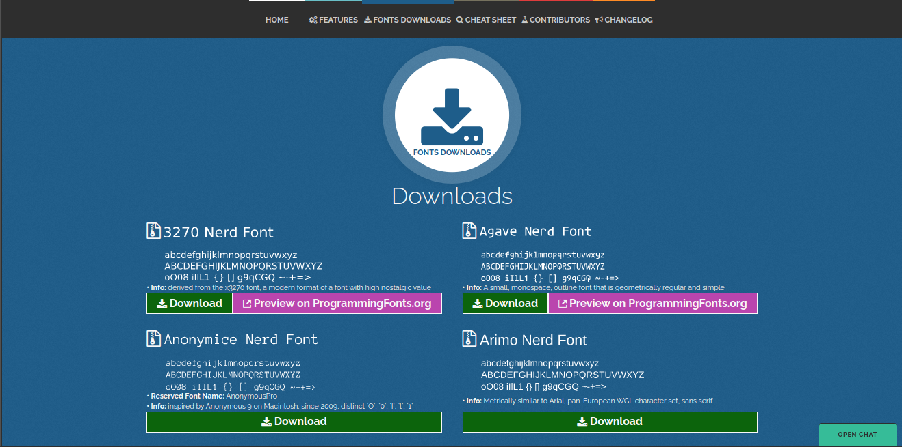

En este caso descargaré `Anonymice Nerd Font`.

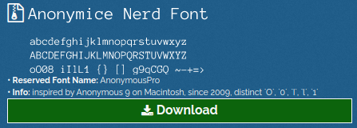

Para instalar la fuente debemos estar como `super usuario`, y nos situamos en la ruta `/usr/share/local/fonts`
```bash
┌[debian]─[12:39-22/06]─[/usr/local/share/fonts]
└╼root$cd /usr/local/share/fonts/
```
donde moveremos el archivo `.zip` que descargamos, recuerden cambiar `hunspook` por su usuario.
```bash
┌[debian]─[12:41-22/06]─[/usr/local/share/fonts]
└╼root$mv /home/hunspook/Descargas/AnonymousPro.zip .
```
Una vez con el archivo en la ruta actual, lo descomprimimos con...
```bash
┌[debian]─[12:42-22/06]─[/usr/local/share/fonts]
└╼root$unzip AnonymousPro.zip
```
y seguidamente eliminamos el archivo `.zip`.
```bash
┌[debian]─[12:42-22/06]─[/usr/local/share/fonts]
└╼root$rm AnonymousPro.zip
```
Les recomiendo cerrar sesión y volver a entrar para asegurarnos de que carguen las fuentes. Si entran a su terminal y les aparece la configuración de PowerLevel10k igual pueden seguir los siguientes pasos.     
Ahora cambiaremos el tipo de fuente dando `click derecho` y entrando a perfil y luego preferencias del perfil.

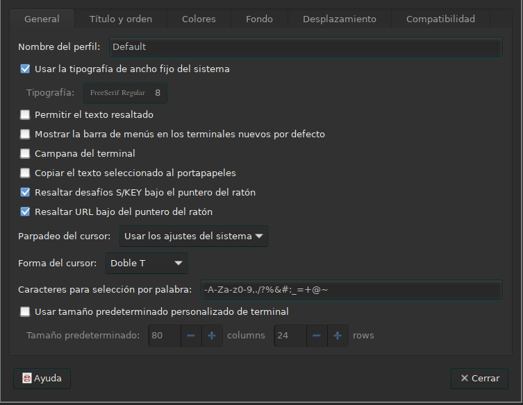

Desmarcamos `Usar la tipografía de ancho fijo del sistema`y en tipografía buscamos el nombre de la fuente que acabamos de descargar y la seleccionamos.

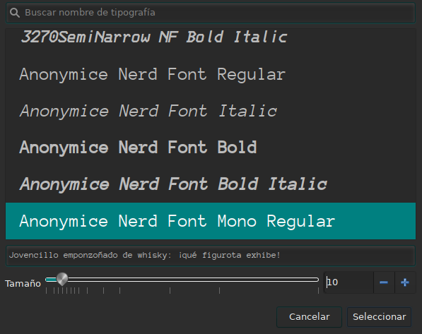

Una vez seleccionado entraremos a otra terminal o si ya están en la configuración continuaremos con los pasos de configuración de PowerLevel10k como vimo en la parte superior.     
Una vez lleguemos a este apartado cada uno tendrá que seleccionar la configuración que más le guste.

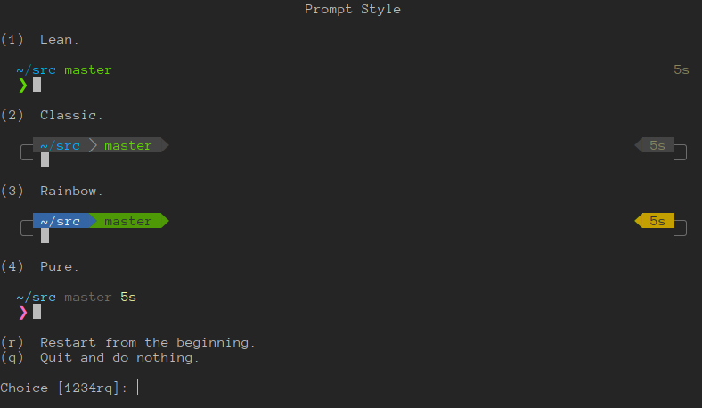

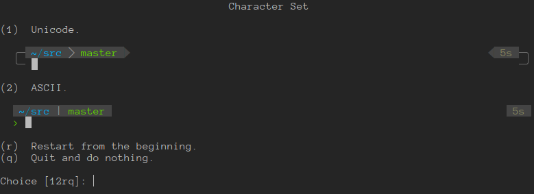

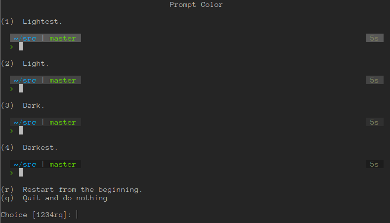

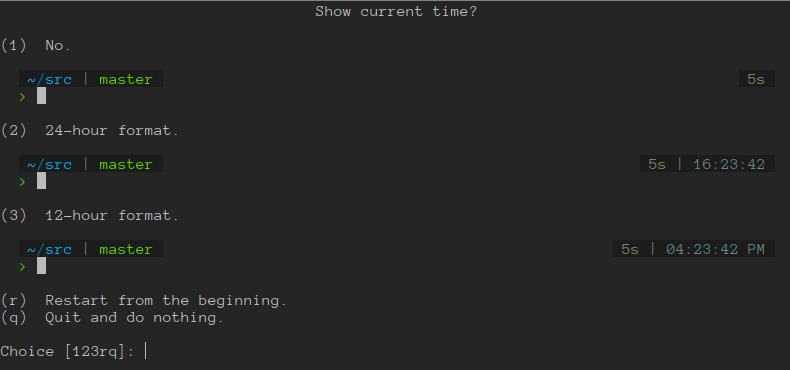

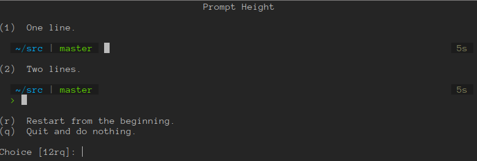

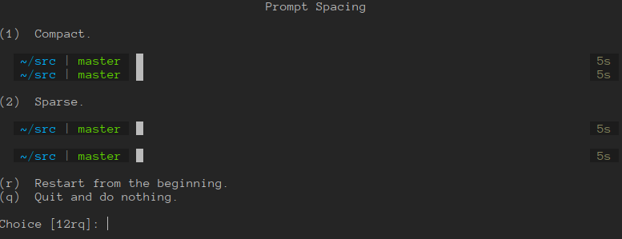

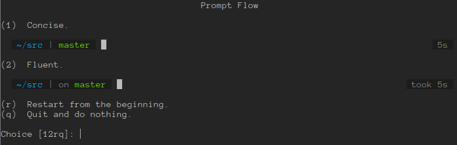

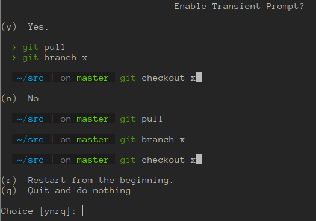

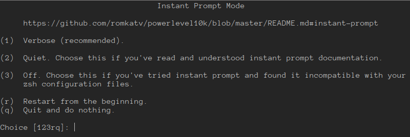

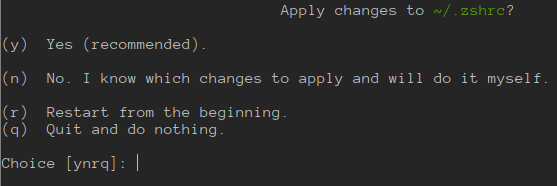

## Mi configuración

· Prompt Style              -> 2     
· Character Set             -> 2     
· Prompt Color              -> 4     
· Show current time?        -> 1     
· Prompt Height             -> 1     
· Prompt Spacing            -> 2     
· Prompt Flow               -> 1     
· Enable Transient Prompt?  -> n      
· Instant Prompt Mode       -> 1     
· Apply changes to ~/.zshrc -> y

| 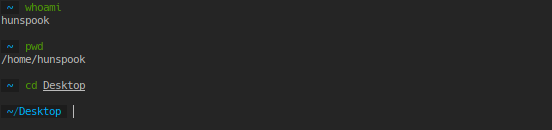 |
|:--:|
| *Mi Configuración* |


** Espero que le haya sido de ayuda Z) **
