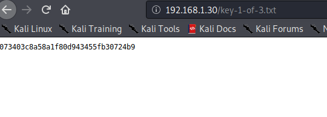

## VM Description

This CTF is based on the show, Mr. Robot. It has three keys hidden in different locations. The goal is to find all three. Each key is progressively difficult to find.

The VM isn't too difficult and is similar to machines you might find in the OSCP labs. There isn't any advanced exploitation or reverse engineering. The level is considered beginner-intermediate.

Download: [Mr. Robot](https://www.vulnhub.com/entry/mr-robot-1,151/)

Author: [Leon Johnson](https://www.vulnhub.com/author/leon-johnson,292/)

## Enumeration

Mr. Robot VM is hosted locally using VMware. In order to find its assigned IP, we can either use *netdiscover* or *arp-scan*.  

```console
root@Nes:~/vulnhub/mrRobot# arp-scan -I wlan0 -l
Interface: wlan0, type: EN10MB, MAC: 1c:4d:70:0d:61:46, IPv4: 192.168.1.83
Starting arp-scan 1.9.7 with 256 hosts (https://github.com/royhills/arp-scan)
192.168.1.22    1c:4d:70:0d:61:46       Intel Corporate

16 packets received by filter, 0 packets dropped by kernel
Ending arp-scan 1.9.7: 256 hosts scanned in 2.379 seconds (107.61 hosts/sec). 4 responded
```

As always, a pen testing task starts with a proper enumeration. The goal is to find as much information about the target as possible.

### Service Enumeration

```console
root@Nes:~/vulnhub/mrRobot# nmap -sV -sC -p- -oA nmap/nmap 192.168.1.22

Starting Nmap 7.60 ( https://nmap.org ) at 2020-08-04 12:53 EDT
Nmap scan report for linux (192.168.1.22)
Host is up (0.00066s latency).
Not shown: 65532 filtered ports
PORT    STATE  SERVICE  VERSION
22/tcp  closed ssh
80/tcp  open   http     Apache httpd
|_http-server-header: Apache
|_http-title: Site doesn't have a title (text/html).
443/tcp open   ssl/http Apache httpd
|_http-server-header: Apache
|_http-title: Site doesn't have a title (text/html).
| ssl-cert: Subject: commonName=www.example.com
| Not valid before: 2015-09-16T10:45:03
|_Not valid after:  2025-09-13T10:45:03
MAC Address: 1C:4D:70:0D:61:46 (Intel Corporate)

Service detection performed. Please report any incorrect results at https://nmap.org/submit/ .
Nmap done: 1 IP address (1 host up) scanned in 118.34 seconds
```

Since Apache HTTPD seems to be running on ports 80 and 443, let's use Gobuster to find interesting files and directories.

#### Web Server Directory Enumeration

We can use Gobuster to enumerate the different directories and files on both ports.

```console
root@Nes:~/vulnhub/mrRobot# gobuster dir -u http://192.168.1.22 -w /usr/share/wordlists/dirbuster/directory-list-2.3-medium.txt -x .php,.txt -o dirbuster.out
===============================================================
Gobuster v3.0.1
by OJ Reeves (@TheColonial) & Christian Mehlmauer (@_FireFart_)
===============================================================
[+] Url:            http://192.168.1.22
[+] Threads:        10
[+] Wordlist:       /usr/share/wordlists/dirbuster/directory-list-2.3-medium.txt
[+] Status codes:   200,204,301,302,307,401,403
[+] User Agent:     gobuster/3.0.1
[+] Extensions:     php,txt
[+] Timeout:        10s
===============================================================
2020/08/04 12:54:30 Starting gobuster
===============================================================
/images (Status: 301)
/index.php (Status: 301)
/blog (Status: 301)
/rss (Status: 301)
/sitemap (Status: 200)
/login (Status: 302)
/0 (Status: 301)
/feed (Status: 301)
/video (Status: 301)
/image (Status: 301)
/atom (Status: 301)
/wp-content (Status: 301)
/admin (Status: 301)
/audio (Status: 301)
/intro (Status: 200)
/wp-login (Status: 200)
/wp-login.php (Status: 200)
/css (Status: 301)
/rss2 (Status: 301)
/license (Status: 200)
/license.txt (Status: 200)
/wp-includes (Status: 301)
/js (Status: 301)
/wp-register.php (Status: 301)
/Image (Status: 301)
/wp-rss2.php (Status: 301)
/rdf (Status: 301)
/page1 (Status: 301)
/readme (Status: 200)
/robots (Status: 200)
/robots.txt (Status: 200)
/dashboard (Status: 302)
```

Gobuster returns multiple files including robots.txt and wp-admin.
We now know that wordpress is running on the host.

<div class="panel panel-info">
      <div class="panel-heading">
        <h3 class="panel-title">Tip:</h3>
      </div>
      <div class="panel-body">
   A robots.txt file tells search engine crawlers which pages or files the crawler can or can't request from the site.The presence of this file in itself is not a security issue; However, it is often used to identify private directories. If the web server's admin relies on robots.txt to restrict access to these directories then this is a security issue. This is why, it is always a good idea to check if robots.txt exists on the web server.
      </div>
    </div>

In this case, robots.txt indicates the presence of the first key as well as fsocity.dic; a wordlist which will be useful if we decide to conduct a brute force attack.




#### Identifying valid WordPress credentials

Based on the error message returned when attempting to authenticate to wordpress; we can enumerate valid usernames. In fact, if the username is not valid we get ***Error: Invalid username*** whereas we get ***The password you entered for the username x is invalid*** if x is a valid user. This is known in the industry as [CWE-204: Observable Response Discrepancy](https://cwe.mitre.org/data/definitions/204.html)

We use the wordlist we just found to enumerate valid credentials. We will need to remove the duplicates from the list for faster results.

We decided to use Burp Intruder to enumerate valid users and Hydra to brute force the user's password. Once we launch the Intruder, we can determine if the username is valid or not based on the output length as the error messages are different.


Now that we know Elliot is a valid username, let's brute force his password.


## Exploit

Once we have valid credentials to WordPress, we can obtain a reverse shell by either:

1. Inserting PHP code into an editable theme.

2. Uploading a malicious plugin.

This [post](https://www.hackingarticles.in/wordpress-reverse-shell/) by Raj Chandel details how to do that.

Since a collection of Web shells is already provided on Kali, we insert a php reverse shell located under /usr/share/webshells/php/php-reverse-shell.php into the twenty-fifteen theme. If you are not running Kali, you can find the shell [here](https://github.com/pentestmonkey/php-reverse-shell)


Once we insert our reverse shell, we set up a Netcat listener and visit the shell's location in order to execute it.


The first thing we do is upgrade our simple reverse shell to a fully interactive TTY.
We use the python pty module as described [here](https://blog.ropnop.com/upgrading-simple-shells-to-fully-interactive-ttys/)

## Privilege Escalation

### Escalating to user Robot

Under Robot home directory, we find a password file (password.raw-md5) containing the MD5 hash of the user's password. We use [CrackStation](https://crackstation.net/) in order to crack it.


Robot password is abcdefghijklmnopqrstuvwyz.


We can now read the 2nd key.


#### Escalating to root

We run the the automated script [LinEnum.sh](https://github.com/rebootuser/LinEnum/blob/master/LinEnum.sh) to enumerate the target.

The script returns that nmap has the SUID bit.  

The interactive mode in nmap, available on versions 2.02 to 5.21 allows us to execute shell commands. We can leverage this to become root. If you did not know that, you can check [gtfobins.](https://gtfobins.github.io/gtfobins/nmap/)


We are now root and we obtain the 3rd and final key. Awesome!


